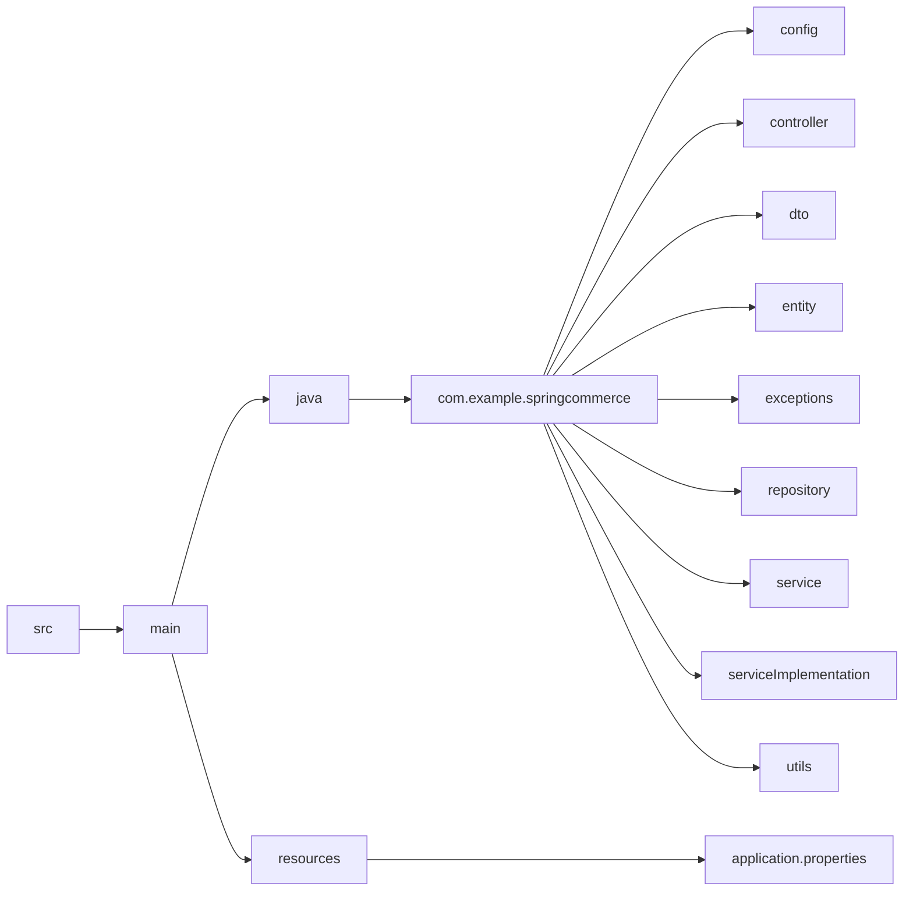

# Spring Basics for Spring Commerce Project

This project is built using:

- **Spring Web**
- **Spring Boot**
- **Spring JPA**
- **Hibernate**
- **Lombok**
- **Hibernate Validators**

This is my first **full-fledged** application in Spring. It includes best practices and code necessary to become a proficient Spring developer.

## Folder Structure

The folder structure of the project is organized as follows:

In Spring commerce will go through all the basics used in my project so that i can refer back them when needed.

So for controller go here :: [Controller](controller.md)