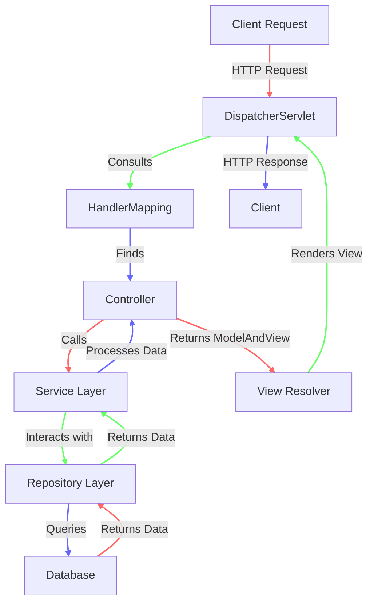

The flow for the what happens after we hit an api

## Explanation

1. `Request Handling`
   The clients sends the request to the server , in Spring booth there is `Embeded Tomcat` server which listens to the
   request and forwards it to the `DispatcherServlet` which is the front controller of the Spring MVC application.

2. `DispatcherServlet`
   This is the core component of spring web module. It act as a front controller intercepting all incoming request and
   then dispatches the request to the appropriate controller. It is responsible for managing the flow of the request.
   This is controlled via the `web.xml` file in spring and automatically by `SpringBootServletInitializer` in Spring
   Boot.

3. `Handler Mapping`
   DispatcherServlet consults the HandlerMapping to map the request to the appropriate controller. The handler mapping
   is responsible for mapping the request to the appropriate controller.

4. `Controller`
   T The controller method processes the request, often calling service methods to perform business logic.

5. `Service Layer`
   The service layer is where the business logic is implemented. It is responsible for processing the data and
   interacting with the repository layer.

6. `Repository Layer`
   The repository layer is responsible for interacting with the database. It is responsible for querying the database
   and returning the data to the service layer.

7. `Database`
   The database is where the data is stored. The repository layer interacts with the database to query the data.
